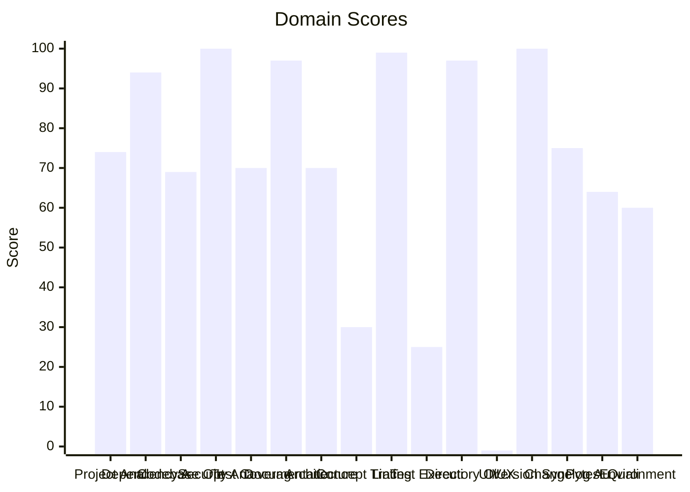

# 🔬 Code Enhancement Report

> **Generated**: 2026-05-22 21:08:34 UTC | **Target**: ansible-tower-mcp | **Overall GPA**: 2.19/4.0

---

## 📊 Executive Summary

| Domain | Grade | Score | Status |
|--------|-------|-------|--------|
| UI/UX Quality | ⚪ N/A | -1/100 | `░░░░░░░░░░░░░░░░░░░░░` -1/100 |
| Test Execution | 🔴 F | 25/100 | `█████░░░░░░░░░░░░░░░` 25/100 |
| Concept Traceability | 🔴 F | 30/100 | `██████░░░░░░░░░░░░░░` 30/100 |
| Environment Variables | 🟠 D | 60/100 | `████████████░░░░░░░░` 60/100 |
| Pytest Quality | 🟠 D | 64/100 | `████████████░░░░░░░░` 64/100 |
| Codebase Optimization | 🟠 D | 69/100 | `█████████████░░░░░░░` 69/100 |
| Test Coverage | 🟡 C | 70/100 | `██████████████░░░░░░` 70/100 |
| Architecture & Design Patterns | 🟡 C | 70/100 | `██████████████░░░░░░` 70/100 |
| Project Analysis | 🟡 C | 74/100 | `██████████████░░░░░░` 74/100 |
| Changelog Audit | 🟡 C | 75/100 | `███████████████░░░░░` 75/100 |
| Dependency Audit | 🟢 A | 94/100 | `██████████████████░░` 94/100 |
| Documentation & Governance | 🟢 A | 97/100 | `███████████████████░` 97/100 |
| Directory Organization | 🟢 A | 97/100 | `███████████████████░` 97/100 |
| Linting & Formatting | 🟢 A | 99/100 | `███████████████████░` 99/100 |
| Security Analysis | 🟢 A | 100/100 | `████████████████████` 100/100 |
| Version Sync Analysis | 🟢 A | 100/100 | `████████████████████` 100/100 |

---

## 📋 Domain Scorecards

### Project Analysis — 🟡 Grade: C (74/100)

`██████████████░░░░░░` 74/100

> [!NOTE]
> Detected ecosystem marker: agent-utilities → Agent-Utilities Ecosystem

| Criterion | Points | Evidence | Reasoning |
|-----------|--------|----------|-----------|
| has_pyproject | 10 | `pyproject.toml and requirements.txt` | Both pyproject.toml and requirements.txt exist, fulfilling mandatory Python proj |
| project_type_detected | 10 | `Agent-Utilities Ecosystem` | Identified 1 ecosystem marker(s) in dependencies |
| externalized_prompts | 0 | `${WORKSPACE_ROOT}/agent-packages/agents/ansible-tower-mcp` | No prompts/ directory found. Prompts may be hardcoded in source. |
| observability | 0 | `dependency list` | No observability tools (logfire, sentry, opentelemetry) found |
| testing_suite | 10 | `tests dir: True, pytest dep: True` | Tests directory exists, pytest in dependencies |
| agents_md | 10 | `${WORKSPACE_ROOT}/agent-packages/agents/ansible-tower-mcp` | AGENTS.md exists with comprehensive content |
| pre_commit_hooks | 10 | `${WORKSPACE_ROOT}/agent-packages/agents/ansible-tower-mcp` | Pre-commit configuration found for automated code quality checks |
| gitignore | 10 | `${WORKSPACE_ROOT}/agent-packages/agents/ansible-tower-mcp` | .gitignore exists to prevent committing build artifacts and secrets |
| env_template | 10 | `${WORKSPACE_ROOT}/agent-packages/agents/ansible-tower-mcp` | Environment template exists for onboarding and secret management |
| protocol_support | 4 | `MCP` | 1 communication protocol(s) detected |

**Findings:**
- Protocol support: MCP

---

### Dependency Audit — 🟢 Grade: A (94/100)

`██████████████████░░` 94/100

> [!TIP]
> Minor update: pytest-xdist 3.6.0 (constraint — not installed) -> 3.8.0

| Criterion | Points | Evidence | Reasoning |
|-----------|--------|----------|-----------|
| dependency_freshness | 94 | `source=${WORKSPACE_ROOT}/agent-packages/agents/ansible-to` | Audited 5 deps (3 installed, 2 constraint-only). 0 major, 2 minor, 0 patch updates |

**Findings:**
- Minor update: agent-utilities 0.2.40 (installed) -> 0.16.0

---

### Codebase Optimization — 🟠 Grade: D (69/100)

`█████████████░░░░░░░` 69/100

> [!WARNING]
> Monolithic: mcp_server.py (707L) — 1 functions with high complexity (worst: get_mcp_instance at 64L, CC=17); Low cohesion: 18 distinct concepts in one file

| Criterion | Points | Evidence | Reasoning |
|-----------|--------|----------|-----------|
| code_quality | 69 | `{"file_count": 28, "total_lines": 3485, "function_count": 15` | Analyzed 28 files, 151 functions. Avg CC=5.0, max length=167, duplication=0.4%,  |

**Findings:**
- 9 functions with nesting depth >4

---

### Security Analysis — 🟢 Grade: A (100/100)

`████████████████████` 100/100

| Criterion | Points | Evidence | Reasoning |
|-----------|--------|----------|-----------|
| security_posture | 100 | `high=0 med=0 low=0 attack_surface={"subprocess_calls": 0, "f` | Scanned 28 files. Found 0 security findings. High: -0pts, Med: -0pts, Low: -0pts |

---

### Test Coverage — 🟡 Grade: C (70/100)

`██████████████░░░░░░` 70/100

> [!NOTE]
> 6 tests without assertions

| Criterion | Points | Evidence | Reasoning |
|-----------|--------|----------|-----------|
| test_coverage_quality | 70 | `{"test_file_count": 6, "test_count": 16, "source_file_count"` | 16 tests across 6 files. Ratio: 0.57. Intent: {'unit': 15, 'integration': 1}. 6  |

**Findings:**
- 14 potential doc-test drift items

---

### Documentation & Governance — 🟢 Grade: A (97/100)

`███████████████████░` 97/100

> [!TIP]
> README.md missing sections: usage|quick start

| Criterion | Points | Evidence | Reasoning |
|-----------|--------|----------|-----------|
| documentation_quality | 97 | `{"README.md": {"exists": true, "missing": ["usage|quick star` | Audited 6 standard docs + docs/ directory. 0 broken references, 5 docs present.  |

**Findings:**
- 2 broken internal links in README.md
- README missing: Has a Table of Contents
- README missing: Has usage examples with code blocks

---

### Architecture & Design Patterns — 🟡 Grade: C (70/100)

`██████████████░░░░░░` 70/100

> [!NOTE]
> SRP: 2 modules exceed 500 lines (god modules)

| Criterion | Points | Evidence | Reasoning |
|-----------|--------|----------|-----------|
| architecture_quality | 70 | `{"layers": 0, "di_ratio": 0.07, "solid_violations": 1}` | Analyzed 28 files. 0/5 architecture layers present, DI ratio: 7%, 1 SOLID violat |

**Findings:**
- No discernible layer architecture (no domain/service/adapter separation)
- Low dependency injection ratio: 7%

---

### Concept Traceability — 🔴 Grade: F (30/100)

`██████░░░░░░░░░░░░░░` 30/100

> [!CAUTION]
> Low traceability ratio: 0% concepts fully traced

| Criterion | Points | Evidence | Reasoning |
|-----------|--------|----------|-----------|
| concept_traceability | 30 | `{"total_concepts": 5, "well_traced": 0, "orphans": 5, "drift` | 5 unique concepts found. 0 fully traced (code+docs+tests), 5 orphans, 0 drifted. |

**Findings:**
- 16 test functions missing concept markers
- 66 significant functions (>10 lines) missing concept markers in docstrings

---

### Linting & Formatting — 🟢 Grade: A (99/100)

`███████████████████░` 99/100

> [!TIP]
> Total lint findings: 1 (high/error: 0, medium/warning: 0, low: 1)

| Criterion | Points | Evidence | Reasoning |
|-----------|--------|----------|-----------|
| lint_compliance | 99 | `ruff=1, bandit=0, mypy=0` | 1 total findings across 3 tools. High/error: -0pts, Med/warning: -0pts, Low: -1p |

---

### Test Execution — 🔴 Grade: F (25/100)

`█████░░░░░░░░░░░░░░░` 25/100

> [!CAUTION]
> No tests were executed (test framework detected but no tests found)

| Criterion | Points | Evidence | Reasoning |
|-----------|--------|----------|-----------|
| test_execution | 25 | `{"frameworks_detected": 1, "total_passed": 0, "total_failed"` | Executed 1 framework(s). 0 passed, 0 failed, 0 errors. Pass rate: 0%. |

---

### Directory Organization — 🟢 Grade: A (97/100)

`███████████████████░` 97/100

> [!TIP]
> 1 rogue/throwaway scripts detected (fix_*, validate_*, patch_*, etc.): scripts/validate_a2a_agent.py

| Criterion | Points | Evidence | Reasoning |
|-----------|--------|----------|-----------|
| directory_organization | 97 | `{"total_source_files": 52, "total_directories": 9, "max_dept` | 52 files across 9 directories. Max depth: 3, avg files/dir: 5.8. 0 crowded, 0 se |

---

### UI/UX Quality — ⚪ Grade: N/A (-1/100)

`░░░░░░░░░░░░░░░░░░░░░` -1/100

> [!TIP]
> No UI detected — domain not applicable

| Criterion | Points | Evidence | Reasoning |
|-----------|--------|----------|-----------|
| ui_detection | -1 | `${WORKSPACE_ROOT}/agent-packages/agents/ansible-tower-mcp` | No web or terminal UI framework detected. Domain skipped. |

---

### Version Sync Analysis — 🟢 Grade: A (100/100)

`████████████████████` 100/100

> [!TIP]
> All version '1.16.0' declarations appear to be tracked correctly.

| Criterion | Points | Evidence | Reasoning |
|-----------|--------|----------|-----------|
| bumpversion_exists | 20 | `${WORKSPACE_ROOT}/agent-packages/agents/ansible-tower-mcp` | .bumpversion.cfg found |
| current_version_defined | 20 | `1.16.0` | Current version tracked is 1.16.0 |
| files_tracked | 20 | `6 files tracked` | Found 6 files tracked in .bumpversion.cfg |
| version_drift_check | 40 | `0 drifted files` | No version drift detected in codebase files |

---

### Changelog Audit — 🟡 Grade: C (75/100)

`███████████████░░░░░` 75/100

> [!NOTE]
> CHANGELOG.md exists but could not be parsed — check format compliance

| Criterion | Points | Evidence | Reasoning |
|-----------|--------|----------|-----------|
| changelog_quality | 75 | `{"exists": true, "parseable": false, "version_count": 0, "ha` | CHANGELOG.md exists. 0 versions tracked. 0 dependency changelogs analyzed. |

**Findings:**
- No changelog entries within the last 30 days
- keepachangelog not installed — pip install 'universal-skills[code-enhancer]'

---

### Pytest Quality — 🟠 Grade: D (64/100)

`████████████░░░░░░░░` 64/100

> [!WARNING]
> 1 test files exceed 500 lines — split into focused modules

| Criterion | Points | Evidence | Reasoning |
|-----------|--------|----------|-----------|
| pytest_quality | 64 | `{"test_files": 6, "total_tests": 16, "descriptive_name_ratio` | 16 tests across 6 files. Naming: 20/20, Structure: 12/20, Fixtures: 7/20, Assert |

**Findings:**
- Test directory lacks subdirectory organization (consider unit/, integration/, e2e/)
- Missing conftest.py for shared fixtures
- No @pytest.mark.parametrize usage — consider data-driven tests
- No shared fixtures in conftest.py

---

### Environment Variables — 🟠 Grade: D (60/100)

`████████████░░░░░░░░` 60/100

> [!WARNING]
> Only 13% of env vars documented in README.md

| Criterion | Points | Evidence | Reasoning |
|-----------|--------|----------|-----------|
| env_var_documentation | 60 | `{"total_vars": 31, "python_vars": 23, "dockerfile_vars": 4, ` | Found 31 unique env vars across 82 occurrences. README documents 4/31. Has .env. |

**Findings:**
- Undocumented env vars: AD_HOC_COMMANDSTOOL, ANSIBLE_BASE_URL, ANSIBLE_CLIENT_ID, ANSIBLE_CLIENT_SECRET, ANSIBLE_PASSWORD, ANSIBLE_USERNAME, ANSIBLE_TOWER_TLS_PROFILE, AUDIENCE, AUTH_TYPE, CREDENTIALSTOOL
- 8 Python env vars not in .env.example: ANSIBLE_BASE_URL, ANSIBLE_CLIENT_ID, ANSIBLE_CLIENT_SECRET, ANSIBLE_PASSWORD, ANSIBLE_USERNAME

---

## 🎯 Prioritized Action Items

| # | Priority | Domain | Action | Impact | Risk |
|---|----------|--------|--------|--------|------|
| 1 | 🔴 High | Concept Traceability | Low traceability ratio: 0% concepts fully traced | High | High |
| 2 | 🔴 High | Concept Traceability | 16 test functions missing concept markers | High | High |
| 3 | 🔴 High | Concept Traceability | 66 significant functions (>10 lines) missing concept markers in docstrings | High | High |
| 4 | 🔴 High | Test Execution | No tests were executed (test framework detected but no tests found) | High | High |
| 5 | 🔴 High | Codebase Optimization | Monolithic: mcp_server.py (707L) — 1 functions with high complexity (worst: get_ | High | Medium |
| 6 | 🔴 High | Codebase Optimization | 9 functions with nesting depth >4 | High | Medium |
| 7 | 🔴 High | Pytest Quality | 1 test files exceed 500 lines — split into focused modules | High | Medium |
| 8 | 🔴 High | Pytest Quality | Test directory lacks subdirectory organization (consider unit/, integration/, e2 | High | Medium |
| 9 | 🔴 High | Pytest Quality | Missing conftest.py for shared fixtures | High | Medium |
| 10 | 🔴 High | Pytest Quality | No @pytest.mark.parametrize usage — consider data-driven tests | High | Medium |
| 11 | 🔴 High | Pytest Quality | No shared fixtures in conftest.py | High | Medium |
| 12 | 🔴 High | Pytest Quality | 6 tests have no assertions | High | Medium |
| 13 | 🔴 High | Pytest Quality | 3 tests exceed 100 lines — likely doing too much per test | High | Medium |
| 14 | 🔴 High | Environment Variables | Only 13% of env vars documented in README.md | High | Medium |
| 15 | 🔴 High | Environment Variables | Undocumented env vars: AD_HOC_COMMANDSTOOL, ANSIBLE_BASE_URL, ANSIBLE_CLIENT_ID, | High | Medium |
| 16 | 🔴 High | Environment Variables | 8 Python env vars not in .env.example: ANSIBLE_BASE_URL, ANSIBLE_CLIENT_ID, ANSI | High | Medium |
| 17 | 🟡 Medium | Project Analysis | Detected ecosystem marker: agent-utilities → Agent-Utilities Ecosystem | Medium | Low |
| 18 | 🟡 Medium | Project Analysis | Protocol support: MCP | Medium | Low |
| 19 | 🟡 Medium | Test Coverage | 6 tests without assertions | Medium | Low |
| 20 | 🟡 Medium | Test Coverage | 14 potential doc-test drift items | Medium | Low |
| 21 | 🟡 Medium | Architecture & Design Patterns | SRP: 2 modules exceed 500 lines (god modules) | Medium | Low |
| 22 | 🟡 Medium | Architecture & Design Patterns | No discernible layer architecture (no domain/service/adapter separation) | Medium | Low |
| 23 | 🟡 Medium | Architecture & Design Patterns | Low dependency injection ratio: 7% | Medium | Low |
| 24 | 🟡 Medium | Changelog Audit | CHANGELOG.md exists but could not be parsed — check format compliance | Medium | Low |
| 25 | 🟡 Medium | Changelog Audit | No changelog entries within the last 30 days | Medium | Low |
| 26 | 🟡 Medium | Changelog Audit | keepachangelog not installed — pip install 'universal-skills[code-enhancer]' | Medium | Low |
| 27 | 🟢 Low | Dependency Audit | Minor update: pytest-xdist 3.6.0 (constraint — not installed) -> 3.8.0 | Low | Low |
| 28 | 🟢 Low | Dependency Audit | Minor update: agent-utilities 0.2.40 (installed) -> 0.16.0 | Low | Low |
| 29 | 🟢 Low | Documentation & Governance | README.md missing sections: usage|quick start | Low | Low |
| 30 | 🟢 Low | Documentation & Governance | 2 broken internal links in README.md | Low | Low |

---

## 🔄 SDD Handoff

Run `generate_sdd_handoff.py` with this report's JSON data to produce
structured TODO items compatible with the `spec-generator` → `task-planner` →
`sdd-implementer` pipeline. Output will be saved to `.specify/specs/`.
